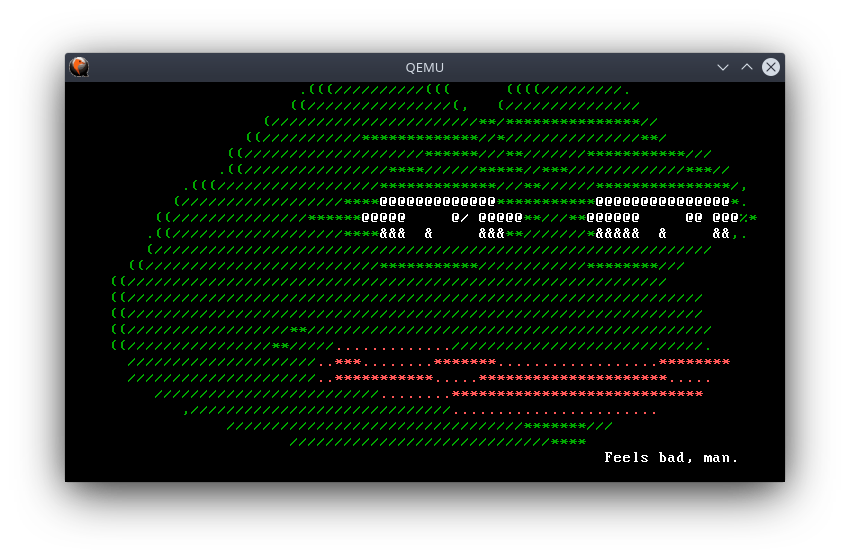

# BastionOS

BastionOS is a 64-bit hobby OS that currently runs only on amd64 (x86_64) architecture. It's maintainer and the only author is not good at OS development and coding on C++, so don't expcect really much from it. It's just the way he haves fun and learns things. This OS lacks all functionality you can expect from a normal OS, an it's code sometimes can look awful. The current goal is to make this OS be somewhat usable.

## Building

To build this OS you'll need GNU/Linux, preferably a Debian-based (or Ubuntu-based) distribution.  
It was never built on Windows, so I can't give any instructions on that.  
  
To build BastionOS you'll need:

- GNU Make ( `sudo apt install make` )
- NASM ( `sudo apt install nasm` )
- A GCC **cross-compiler** for x86_64-elf target
  - libgcc should be compiled with `-mno-red-zone` and `-mcmodel=large`

**GCC and Binutils for x86_64-elf target can be downloaded [HERE](https://github.com/TheArturZh/BastionOS-Build-Tools/releases "Toolchain releases")**

Built binutils, cross-compiler and it's libraries should be placed in `./build-tools` . You should have the following file structure:

    ./
        /build-tools
            /x86_64-elf
            /share
            /libexec
            /bin
            /lib

You can place them somewhere else, but you'll have to change the path to GCC in Makefile (CXX and LINKER variables).

After you install all required tools, you should jump into  main directory of BastionOS repository clone and run `make image`. If build was successful, an OS disc image named **os.iso** will be in `./build/` directory.

## Emulation

If you have QEMU installed, you can use `make run` or `make qemu` to run the OS in QEMU.

If you want to run it in Bochs, it is recommended to compile Bochs using the following configuration:  

    ./configure --enable-cpu-level=6 \
                --enable-all-optimizations \
                --enable-x86-64 \
                --enable-pci \
                --enable-debugger \
                --enable-disasm \
                --enable-debugger-gui \
                --enable-logging \
                --enable-fpu \
                --enable-3dnow \
                --enable-sb16=dummy \
                --enable-cdrom \
                --enable-x86-debugger \
                --enable-iodebug \
                --disable-plugins \
                --disable-docbook \
                --with-x --with-x11 --with-term --with-sdl2

Then change the path to Bochs executable in Makefile.

You don't have to pass any arguments to Bochs, you should just run it from the root of repository clone, as it already contains Bochs configuration file (bochsrc). You can use `make bochs` to do that.
